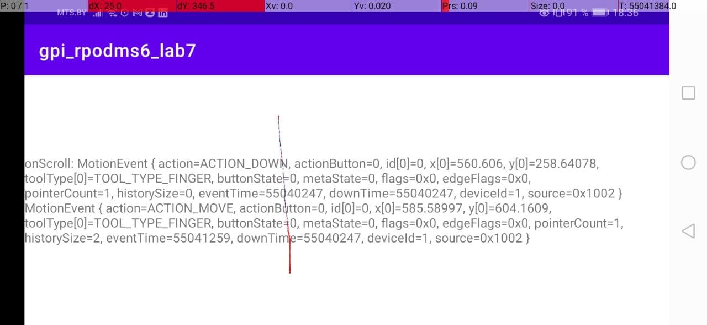
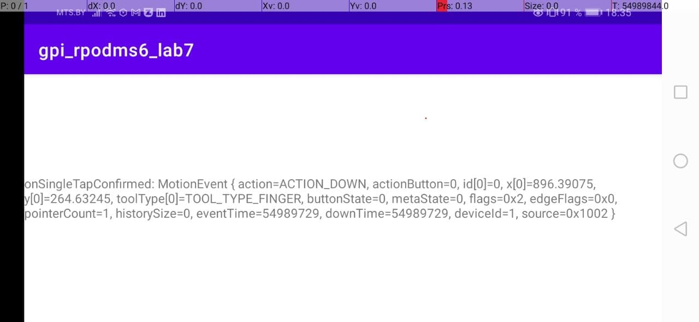

## Demo

| Картинка                                                           | Описание                                                                                                                                  |
| ------------------------------------------------------------------ | ----------------------------------------------------------------------------------------------------------------------------------------- |
|                                                                    |                                                                                                                                           |
|      | onDoubleTapEvent - отслеживает появление события во время выполнения жеста двойного нажатия, включая касание, перемещение, подъем пальца. |
|               | onFling - отслеживает появление жеста смахивания                                                                                          |
|           | onLongPress - отслеживает удерживание пальца прижатым к экрану длительное время                                                           |
|              | onScroll - отслеживает появление жеста прокрутки (пролистывания)                                                                          |
|  | onSingleTapConfirmed - отслеживает появление жеста одиночного нажатия (клик)                                                              |
